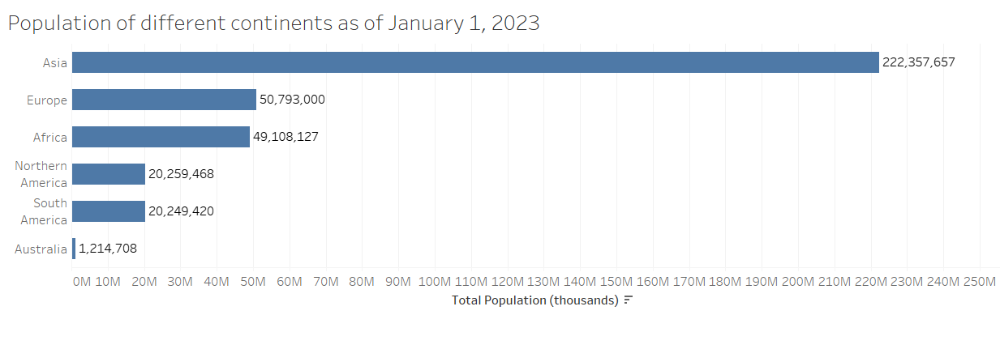
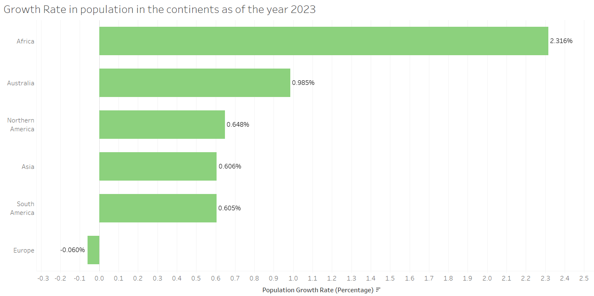
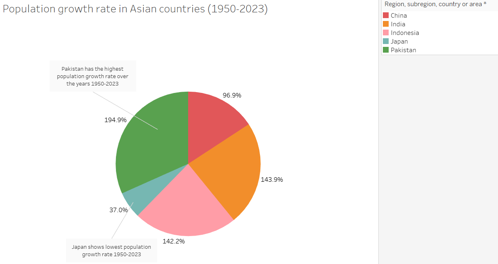
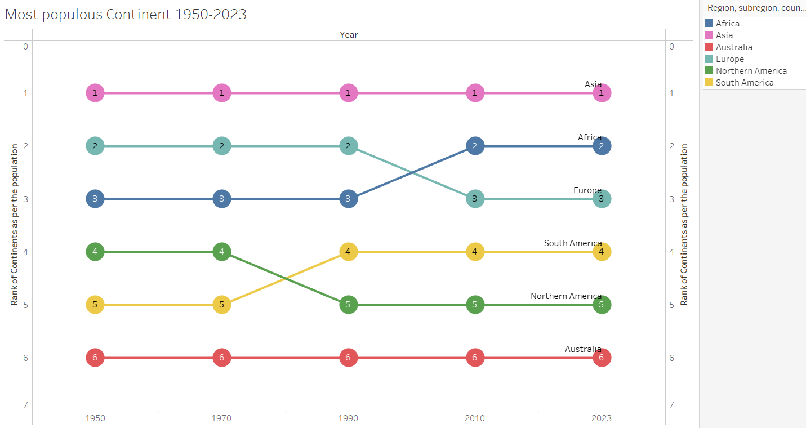
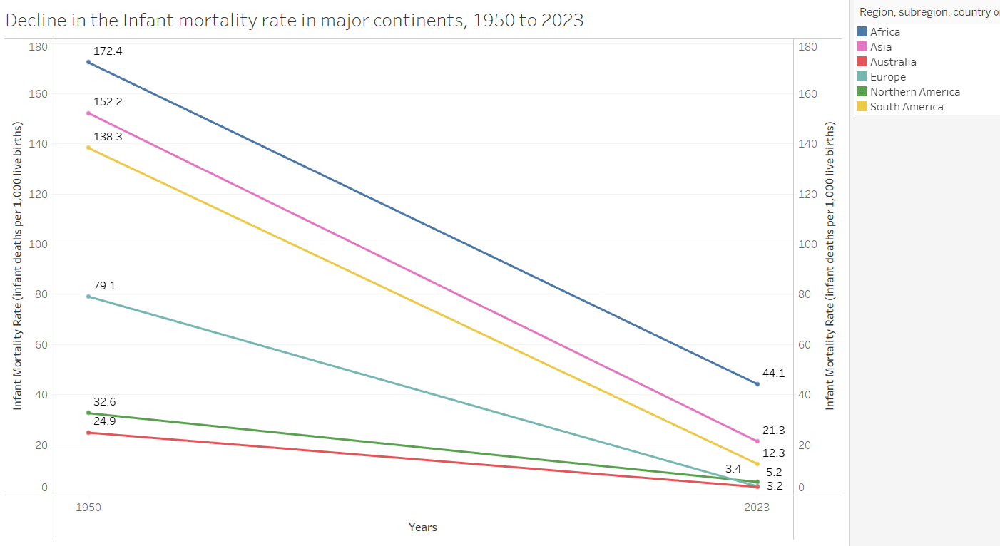

# UN Population dataset

## About the Project

Visualizing population trends over the past 70 years in a compelling and insightful way that reveals new information to the audience. 
The goal is to craft a data-driven narrative using innovative visualization techniques to highlight key demographic changes with a focus on population. 

Using relevant variables from the United Nations dataset, created the following charts:

-**Introductory Chart(s):** Highlighting magnitude or part-to-whole relationships, providing a foundation for the main visualizations that follow.

-**Bump Chart:** Showing how rankings or relative positions have changed over time.

-**Slope Chart:** Illustrating trends by showing changes between two points in time, emphasizing differences or growth.

-**Connected Scatterplot:** Visualizing relationships and trends between two variables over time, revealing patterns that may not be apparent in simpler charts. 

## Tableau Visualization

I utilized Tableau to create a visual representation of the data. 

### Snapshots

The magnitude chart or Bar chart shows how different continents of the world differ in terms of population as of Jan 2023. Asia shows the largest recorded population which is much higher than the other continents. Australia has the lowest population recorded in January 2023. North America and South America have almost the same total population, while Europe is the most populous continent in the year 2023. Africa stands in third place in terms of the most populous continent in 2023.

This magnitude chart visualizes the population growth rate in percentages for different continents from the previous year to 2023. Africa noticed the highest population growth rate from the year 2022 to 2023 whereas Asia and South America display the lowest positive growth rate. For Europe, the population growth rate is negative depicting that there has been a decline in population from 2022 to 2023.

Among the world's continents, Asia showed the largest population in the year 2023. This pie chart visualizes major countries within Asia and their population growth rate. Pakistan leads with the highest population growth rate of around 194.9%, followed by India with the second highest population growth rate of 143.9%. The higher population growth rate may be due to various factors like lower mortality rate, higher birth rate, higher fertility, etc. Indonesia (142.2%) and China (96.9%) are in the third and fourth position respectively, in terms of population growth rate. Japan had the lowest population growth rate of 37% from the years 1950 to 2023 which may be due to their government’s initiative to control the population growth.

The chart displays the rank of the continents in terms of population. Asia consistently ranks number
one in the most populous continent throughout the entire period, while Australia holds steady at
number six. The ranking of most other continents fluctuates over the 73 years. Europe dropped from number two in 1990 to number three in 2010. Similarly, Northern America has also experienced slight declines in its rankings over time. However, Africa suddenly moved from rank three to two in 2010 and South America jumped to rank 4 from 5 in the year 1990.

The slope chart above illustrates the Infant mortality rate, indicating a significant global
decline since 1950. However, the decline in child mortality has not been consistent across all countries. Some continents, such as Africa and Asia, still exhibit relatively high infant mortality rates. Nevertheless, even in these continents, considerable progress has been made over time. The slope chart effectively portrays the data across two years (1950-2023), facilitating the identification of overall growth while minimizing noise.

The chart displays a filtered set of continents to make the graph easier to read. We can readily observe a correlation between life expectancy at birth and the total fertility rate over the span of 23 years (2000-2023). It can be observed that for each of the continents, the life expectancy at birth is increasing due to better education and healthcare facilities while the total fertility rate is decreasing over the years may be due to declining physical health and increasing issues of stress, smoking, drinking among females. Based on the chart, its visible that Africa has the lowest life expectancy at birth while Australia has the highest life expectancy at birth. This can be due to Australia having better healthcare facilities than Africa. For Europe, there was a hike in the total fertility rate but it returned to its original count by 2023. Life expectancy for North America didn’t change much in 2000 and 2023. Both South America and Asia experienced a sudden dip in life expectancy at birth in 2021 but went back up by 2023.

## How to Use

To view the visualization, follow these steps:
1. Download the Tableau workbook from the repository.
2. Open Tableau Desktop or Tableau Public.
3. Open the downloaded workbook to interact with the visualization.

